#### Здесь собраны гифки маленького размера 240x240 пикселей для киберкуба модели `HelloCubic-Lite,Version: V7.0.16`, размер `gif` от `198кб` до `8кб` с тематикой в основном `пиксель-арт`, в куб вмещается примерно 20 gif, для сжатия и изменения размера использовал [ezgif](https://ezgif.com)

## Список гифок

### Основная коллекция

| Превью | Файл | Описание | Разрешение | Размер |
|---|---|---|---|---|
|  | `bitcoin.gif` | Хакер в маске Гая Фокса медитирует под монетой биткоина | 240x240 | 46 КБ |
|  | `boot.gif` | Экран загрузки Windows XP | 240x240 | 56 КБ |
| 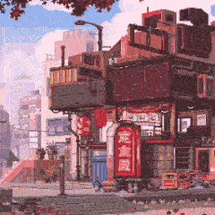 | `china.gif` | Азиатский квартал с красными вывесками и сакурой | 240x240 | 88 КБ |
| 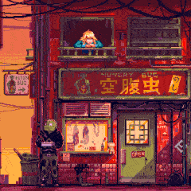 | `chinabandit.gif` | Китайская лавка с неоновой вывеской и персонажем у входа | 240x240 | 69 КБ |
| 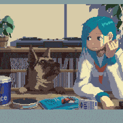 | `dog.gif` | Девушка с голубыми волосами и овчарка у окна | 240x240 | 93 КБ |
| 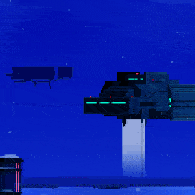 | `duskdribbler.gif` | Летающий корабль над ночным синим морем | 240x240 | 66 КБ |
| 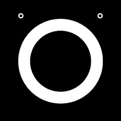 | `facewhite.gif` | Минималистичное «лицо»: белое кольцо и два глаза на чёрном фоне | 240x240 | 65 КБ |
| 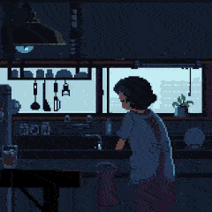 | `grandmazer.gif` | Девушка на кухне у окна | 240x240 | 52 КБ |
| 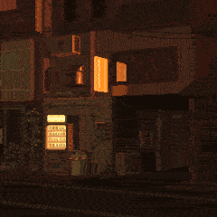 | `home.gif` | Тёмный переулок с тёплым светом окон и вывеской | 240x240 | 63 КБ |
| 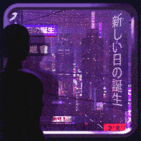 | `kuberglas.gif` | Силуэт на фоне фиолетового неонового города с иероглифами | 240x240 | 85 КБ |
| 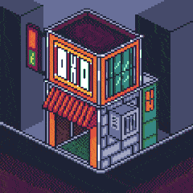 | `kuberhouse.gif` | Изометрический киберпанк-домик | 240x240 | 10 КБ |
| 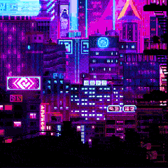 | `kuberpunk.gif` | Розово-синий неоновый мегаполис | 240x240 | 104 КБ |
| 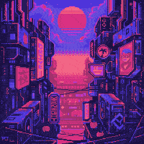 | `kybersolar.gif` | Закат над киберпанк-улицей | 240x240 | 33 КБ |
| 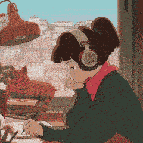 | `lofigerl.gif` | Lofi girl в наушниках пишет в тетради, рядом кот | 240x240 | 104 КБ |
| 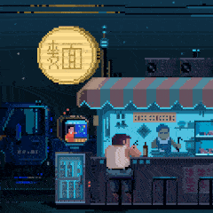 | `meneat.gif` | Ночная уличная лапшичная с посетителем за стойкой | 240x240 | 39 КБ |
| 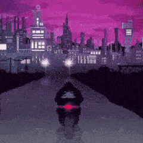 | `moto.gif` | Мотоциклист едет в ночной город | 240x240 | 88 КБ |
| 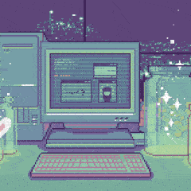 | `pc.gif` | Ретро-компьютер в пастельных тонах | 240x240 | 8 КБ |
| 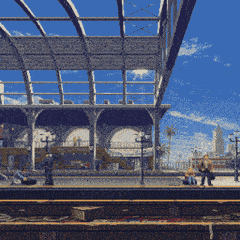 | `poezd.gif` | Вокзальная платформа под стеклянной крышей | 240x240 | 91 КБ |
|  | `pussy.gif` | Девушка на диване (не пиксель-арт) | 240x240 | 88 КБ |
|  | `rocket.gif` | Летящая ракета на тёмном фоне | 240x240 | 27 КБ |
| 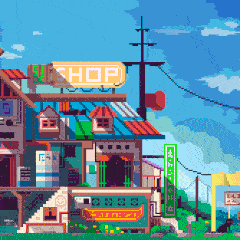 | `shop.gif` | Яркий магазинчик под голубым небом | 240x240 | 76 КБ |
| 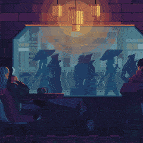 | `sitypeople.gif` | Силуэты людей у большого окна под тёплой лампой | 240x240 | 48 КБ |
| 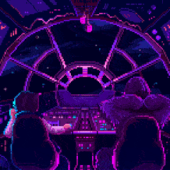 | `starwars.gif` | Кабина «Тысячелетнего сокола» в неоновых тонах | 240x240 | 73 КБ |
| 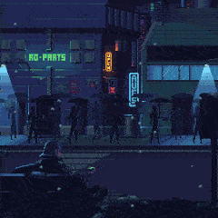 | `street.gif` | Дождливая ночная улица с прохожими под зонтами | 240x240 | 94 КБ |
| 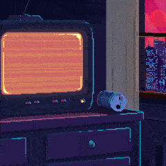 | `videocat.gif` | Старый телевизор с помехами в неоновой комнате | 240x240 | 76 КБ |
| 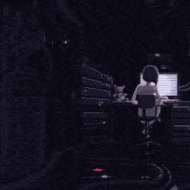 | `womanpc.gif` | Девушка за компьютером в тёмной комнате | 240x240 | 35 КБ |
| 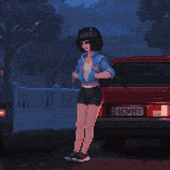 | `women.gif` | Девушка у красной машины ночью | 240x240 | 129 КБ |
| 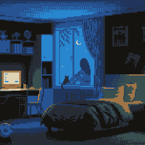 | `womenandcat.gif` | Ночная спальня, девушка с котом у окна под луной | 240x240 | 11 КБ |
| 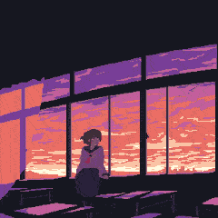 | `womenhouse.gif` | Девушка сидит у панорамного окна на закате | 240x240 | 55 КБ |

### Дополнение (найдено на [GIPHY](https://giphy.com), обрезано до квадрата и сжато до 240x240)

| Превью | Файл | Описание | Разрешение | Размер | Источник |
|---|---|---|---|---|---|
| 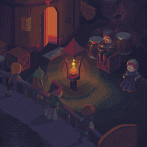 | `tavern.gif` | Изометрическая таверна: компания у стола при свете свечи | 240x240 | 41 КБ | [GIPHY](https://giphy.com/gifs/1yld7nW3oQ2IyRubUm) |
| 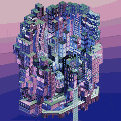 | `isocity.gif` | Изометрический квартал-мегаструктура в сиреневом неоне | 240x240 | 106 КБ | [GIPHY](https://giphy.com/gifs/3d-city-neon-2voemgSwqCMzyy8ohD) |
| 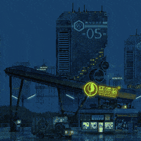 | `rainstation.gif` | Дождливая ночь, эстакада и светящаяся вывеска у небоскрёба | 240x240 | 100 КБ | [GIPHY](https://giphy.com/gifs/3dhmyq6EKw2x7eFt4X) |
| 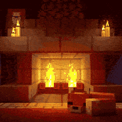 | `fireplace.gif` | Тёплая комната с горящим камином и свечами | 240x240 | 146 КБ | [GIPHY](https://giphy.com/gifs/4L2iGQ26ppzt7LT25o) |
| 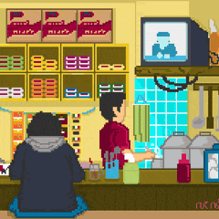 | `warung.gif` | Уличная закусочная: посетитель в худи и повар за стойкой | 240x240 | 23 КБ | [GIPHY](https://giphy.com/gifs/pixel-eating-indonesia-8L1JyDBujxrVZcwS5m) |
| 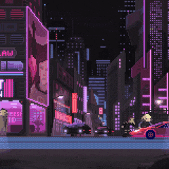 | `neonstreet.gif` | Ночная киберпанк-улица с розовыми вывесками и машинами | 240x240 | 79 КБ | [GIPHY](https://giphy.com/gifs/pixel-art-cyberpunk-animation-9B7XwCQZRQfQs) |
| 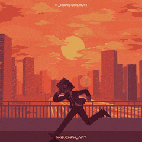 | `runner.gif` | Человек с портфелем бежит по мосту на фоне оранжевого заката | 240x240 | 75 КБ | [GIPHY](https://giphy.com/gifs/pixel-night-8bit-A5ffIYwJoEpVcMOYiO) |
| 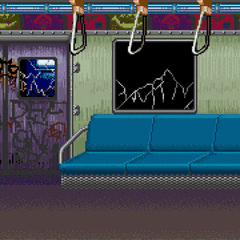 | `metro.gif` | Вагон метро с граффити, за окном мелькают горы | 240x240 | 96 КБ | [GIPHY](https://giphy.com/gifs/GSfsJRun7it0Fl0NLm) |
| 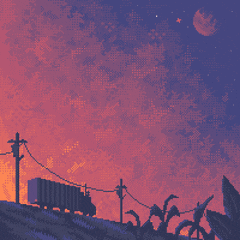 | `duskroad.gif` | Грузовик едет по холму под розово-фиолетовым звёздным небом | 240x240 | 22 КБ | [GIPHY](https://giphy.com/gifs/stars-pixel-art-8bit-J5A1a5C0j1bQuteCtq) |
| 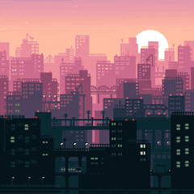 | `pinkcity.gif` | Розовый закат над крышами большого города | 240x240 | 52 КБ | [GIPHY](https://giphy.com/gifs/coelho-fabiocoelho-fpc1987-LSKHkpRJySs5W81D7B) |
| 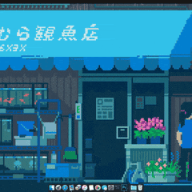 | `fishshop.gif` | Японская лавка аквариумных рыбок с голубым навесом | 240x240 | 53 КБ | [GIPHY](https://giphy.com/gifs/art-beautiful-backgrounds-N3yLGQ1oMYfGU) |
| 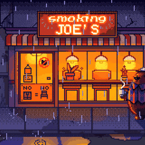 | `smokingjoes.gif` | Закусочная Smoking Joe's под дождём, тёплый свет из окон | 240x240 | 90 КБ | [GIPHY](https://giphy.com/gifs/bear-pixel-art-ioana-sopov-RIpj8HJGVGGTUdM76b) |
| 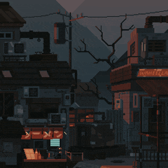 | `hilltown.gif` | Сумрачный городок на склоне с голым деревом и редкими огнями | 240x240 | 54 КБ | [GIPHY](https://giphy.com/gifs/cinemagraph-RkDZq0dhhYHhxdFrJB) |
| 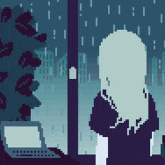 | `rainwindow.gif` | Девушка смотрит в окно на дождь, рядом ноутбук | 240x240 | 24 КБ | [GIPHY](https://giphy.com/gifs/U9Fp3ZNzHmOZi) |
| 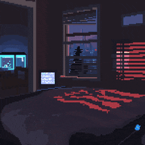 | `bedroom.gif` | Ночная спальня: кот на подоконнике и мерцающий монитор | 240x240 | 89 КБ | [GIPHY](https://giphy.com/gifs/coelho-fabiocoelho-fpc1987-ZCSZp478OpzSMpAAFc) |
| 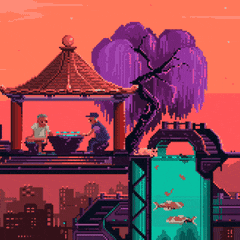 | `pagoda.gif` | Двое играют в беседке под ивой на закате, внизу аквариум | 240x240 | 45 КБ | [GIPHY](https://giphy.com/gifs/pixel-art-jeff-ZCZ7FHlu3sPek3h0zP) |
| 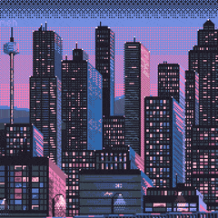 | `skyline.gif` | Небоскрёбы с мигающими окнами и телебашней в сумерках | 240x240 | 123 КБ | [GIPHY](https://giphy.com/gifs/aqHume3xa1ZwXKhfyT) |
| 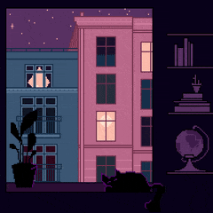 | `catwindow.gif` | Вечерний дом с горящими окнами и кот на карнизе | 240x240 | 23 КБ | [GIPHY](https://giphy.com/gifs/cat-pixel-art-glas2022-coaZJuocefZvhGs1Dv) |
| 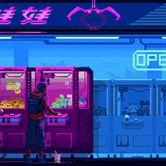 | `gacha.gif` | Человек у неоновых автоматов с игрушками | 240x240 | 94 КБ | [GIPHY](https://giphy.com/gifs/pixel-art-jeff-gH1jGsCnQBiFHWMFzh) |
| 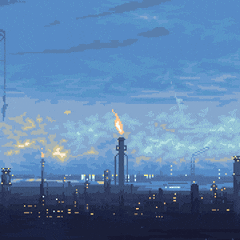 | `refinery.gif` | Синие сумерки над промзоной с горящим факелом (игра Norco) | 240x240 | 14 КБ | [GIPHY](https://giphy.com/gifs/RawFury-video-game-indie-norco-hQw1HLgKZCpBIwehiq) |
| 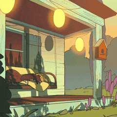 | `porch.gif` | Уютная веранда с бумажными фонариками и креслом | 240x240 | 74 КБ | [GIPHY](https://giphy.com/gifs/animated-cozy-porch-ianAz6rcKfjoY) |
| 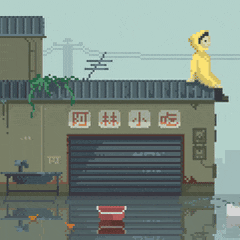 | `floodedshop.gif` | Затопленная улица, человек в жёлтом дождевике на крыше лавки | 240x240 | 27 КБ | [GIPHY](https://giphy.com/gifs/pixel-art-jeff-iiJ870TcI3PZKxatzS) |
| 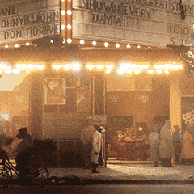 | `nightmarket.gif` | Ночной переулок в огнях гирлянд, прохожий под дождём (игра Backbone) | 240x240 | 198 КБ | [GIPHY](https://giphy.com/gifs/RawFury-raccoon-backbone-howard-lotar-j3OL6mSc2FeV0UHMDg) |
| 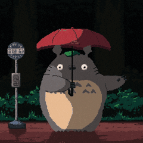 | `totoro.gif` | Тоторо с красным зонтом на автобусной остановке под дождём | 240x240 | 93 КБ | [GIPHY](https://giphy.com/gifs/rain-weather-umbrella-j9jShLBEYbcHj0DIKA) |
| 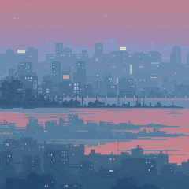 | `hazecity.gif` | Город в утренней дымке, отражающийся в воде | 240x240 | 42 КБ | [GIPHY](https://giphy.com/gifs/feature-knBA26sv2ueXK) |
|  | `neontower.gif` | Многоярусный киберпанк-город с неоновыми вывесками | 240x240 | 60 КБ | [GIPHY](https://giphy.com/gifs/pixel-art-jeff-lkceXNDw4Agryfrwz8) |
|  | `koffie.gif` | Кофейня на фоне города и заходящего солнца | 240x240 | 31 КБ | [GIPHY](https://giphy.com/gifs/glas2022-piVPM99dJDFxwfCDnw) |
|  | `baynight.gif` | Ночной город над заливом, луна и блики на воде | 240x240 | 54 КБ | [GIPHY](https://giphy.com/gifs/qGWVA1zoivT7a) |
|  | `forestvillage.gif` | Домики с фонарями в тёмном лесу у водопада | 240x240 | 53 КБ | [GIPHY](https://giphy.com/gifs/art-pixel-rzeWnbH8Uc5Y4) |
|  | `couple.gif` | Пара сидит на диване под лампой у окна, за окном дождь | 240x240 | 81 КБ | [GIPHY](https://giphy.com/gifs/leroypatterson-pixel-art-rain-jay-silver-ssTuHIyG3cF2VCPIa4) |
|  | `synthcar.gif` | Синтвейв: машина едет к городу на фоне огромного солнца | 240x240 | 73 КБ | [GIPHY](https://giphy.com/gifs/uAQm7xzHC0OB2VnSz4) |
|  | `isoroom.gif` | Изометрическая комната с кроватью, книжными полками и компьютером | 240x240 | 80 КБ | [GIPHY](https://giphy.com/gifs/Dumativa-game-jogo-bagdex-vCCLGNgLiPjnMQ0miX) |
|  | `lofivi.gif` | Девушка с розовыми волосами пьёт чай на диване (Vi, League of Legends) | 240x240 | 142 КБ | [GIPHY](https://giphy.com/gifs/leagueoflegends-league-of-legends-8-bit-vi-w2MPFkd1Re79K9zmaU) |
|  | `sunsetcoffee.gif` | Девушка с чашкой кофе у окна на закате | 240x240 | 103 КБ | [GIPHY](https://giphy.com/gifs/pixel-retro-lofi-xQ7NKUKR2qg0jQ5uwC) |
|  | `redsunset.gif` | Алый закат над водой с плывущими облаками | 240x240 | 77 КБ | [GIPHY](https://giphy.com/gifs/xWMPYx55WNhX136T0V) |

### Динамичные гифки (найдено на [GIPHY](https://giphy.com); крупная анимация на 40%+ кадра, обрезано до квадрата и сжато до 240x240, каждая не более 100 КБ)

| Превью | Файл | Описание | Разрешение | Размер | Источник |
|---|---|---|---|---|---|
|  | `nyancat.gif` | Nyan Cat бежит, оставляя радужный шлейф | 240x240 | 69 КБ | [GIPHY](https://giphy.com/gifs/cat-pixel-art-nyan-7lsw8RenVcjCM) |
|  | `pacman.gif` | Пакман и четыре привидения проносятся через весь экран | 240x240 | 90 КБ | [GIPHY](https://giphy.com/gifs/l8G8sdTRURRBANPpPR) |
|  | `samus.gif` | Самус Аран бежит на месте (Metroid) | 240x240 | 54 КБ | [GIPHY](https://giphy.com/gifs/nes-metroid-samus-IffLnwlgZNgAQlVFT1) |
|  | `swordsman.gif` | Мечник-чиби рубит слизней в прыжке | 240x240 | 87 КБ | [GIPHY](https://giphy.com/gifs/retro-pixel-art-lotto-AHMPR6ASCvZY17KsdB) |
|  | `sora.gif` | Сора отбивается от Бессердечного на островке (Kingdom Hearts) | 240x240 | 96 КБ | [GIPHY](https://giphy.com/gifs/dan-bahia-uzpjgAYcspoLqcXUlT) |
|  | `blockdance.gif` | Танцующий человечек в стиле Minecraft | 240x240 | 93 КБ | [GIPHY](https://giphy.com/gifs/gt8studios-minecraft-movie-animation-fnl61wgIVOKFZxyrv4) |
|  | `goose.gif` | Гусь в шапке и шарфе шагает сквозь снегопад | 240x240 | 96 КБ | [GIPHY](https://giphy.com/gifs/pixel-8-bit-16-bit-xThuWsnKSy4WAs1qso) |
|  | `bat.gif` | Летучая мышь машет крыльями на оранжевом фоне | 240x240 | 92 КБ | [GIPHY](https://giphy.com/gifs/halloween-october-happy-mAKxJhBdfC2WzHmcYJ) |
|  | `catufo.gif` | Кот и девушка в летающей тарелке с разноцветными огнями | 240x240 | 41 КБ | [GIPHY](https://giphy.com/gifs/cat-space-pixel-art-l0Iynn52QIercS9Us) |
|  | `stormcat.gif` | Кот вцепился в дерево во время урагана (не пиксель-арт) | 240x240 | 89 КБ | [GIPHY](https://giphy.com/gifs/RespectiveCollective-thunder-pouring-storming-sd8nb3BsvWp9sJVnNh) |
|  | `coin.gif` | Вращающаяся золотая монета крупным планом | 240x240 | 26 КБ | [GIPHY](https://giphy.com/gifs/GoricinaProductions-deep-coin-the-game-TiDqYW1SQiA38RgoyY) |
|  | `spaceshooter.gif` | Ретро-шутер: корабли и взрывы над поверхностью планеты | 240x240 | 85 КБ | [GIPHY](https://giphy.com/gifs/llimoo-pixel-llimo-space-llimoo-7skvzA3TWCH6Wfiju7) |
|  | `starfighter.gif` | Космический истребитель ведёт огонь среди звёзд | 240x240 | 97 КБ | [GIPHY](https://giphy.com/gifs/arcade-pixel-art-8bit-A0CelPeMKJCRong7jY) |
|  | `warp.gif` | Корабль уходит в гиперпрыжок: звёзды сменяются лучами | 240x240 | 98 КБ | [GIPHY](https://giphy.com/gifs/photoshop-after-effects-kristian-andrews-eMUfbNbRakkRZhFQfs) |
|  | `cavetriangle.gif` | Полёт сквозь изумрудную пещеру к неоновому треугольнику | 240x240 | 95 КБ | [GIPHY](https://giphy.com/gifs/pixel-alien-speed-DHGA5nDLcRDXDnj3pG) |
|  | `helicopter.gif` | Вертолёт летит над зелёными островами в океане | 240x240 | 95 КБ | [GIPHY](https://giphy.com/gifs/endangeredlabs-panda-pandas-ailu-CiLi6LsCoHA89V0iAO) |
|  | `oldcar.gif` | Чёрно-белый ретро-автомобиль мчится по лесной дороге (игра The Longest Road on Earth) | 240x240 | 92 КБ | [GIPHY](https://giphy.com/gifs/RawFury-car-pixel-art-the-longest-road-on-earth-ABW8KjznSwd4drqMuK) |
|  | `retroroad.gif` | Извилистая трасса в стиле аркадных гонок 80-х | 240x240 | 79 КБ | [GIPHY](https://giphy.com/gifs/sky-road-marks-xUPGcI2O9EJMHcZG5G) |
|  | `palms.gif` | Силуэты пальм проносятся на фоне фиолетово-розового заката | 240x240 | 95 КБ | [GIPHY](https://giphy.com/gifs/gustavo-loop-kidmograph-trip-4c6FN5RIzikwg) |
|  | `mountains.gif` | Параллакс: горы, ёлки и плывущие бирюзовые облака | 240x240 | 97 КБ | [GIPHY](https://giphy.com/gifs/pixel-art-mountain-parallax-69XX5Hz66wxCqeoMHu) |
|  | `rainbowhills.gif` | Переливающиеся радужные холмы и неоновые облака | 240x240 | 91 КБ | [GIPHY](https://giphy.com/gifs/landscape-czplol-paisajito-EzST4Po91YFWEzgd51) |
|  | `nightbeach.gif` | Волны накатывают на ночной пляж | 240x240 | 70 КБ | [GIPHY](https://giphy.com/gifs/k5GcybwY1yybmGwrFg) |
|  | `seaclouds.gif` | Море с плывущими облаками и всплеском на воде | 240x240 | 88 КБ | [GIPHY](https://giphy.com/gifs/beach-shanti-gifs-pixel-YlAoz6SamKrQ3WO8r0) |
|  | `snowtokyo.gif` | Густой снегопад среди ночных небоскрёбов | 240x240 | 90 КБ | [GIPHY](https://giphy.com/gifs/snow-winter-tokyo-l46C9nbNh1sYxqgHm) |
|  | `fullmoon.gif` | Полная луна над лесом, вспышка молнии и силуэт на фоне диска | 240x240 | 94 КБ | [GIPHY](https://giphy.com/gifs/demon-slayer-full-moon-aesthetic-mj4ruS6mHkdKEdmwc1) |
|  | `neonbars.gif` | Бегущие сине-голубые неоновые полосы на чёрном | 240x240 | 97 КБ | [GIPHY](https://giphy.com/gifs/pixel-art-blender-Tq5GN6FHyUdPbyBdVc) |
|  | `pulse.gif` | Расходящиеся розово-бирюзовые ромбы и вспышка | 240x240 | 97 КБ | [GIPHY](https://giphy.com/gifs/motionaddicts-motion-addicts-wObsvnB9LLRp6) |
|  | `synthkeys.gif` | Синтезатор с мигающими клавишами над неоновой сеткой | 240x240 | 87 КБ | [GIPHY](https://giphy.com/gifs/party-disco-8bit-l2Sq5wEUhcTsQCyxG) |
